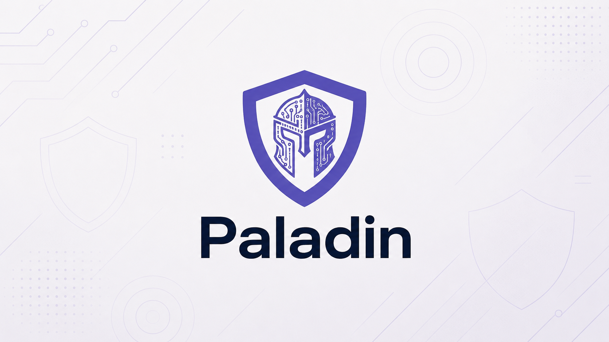

# Paladin



Security review for pull requests, repositories, and mitigation planning.

Paladin is a local skill plugin for AI-native engineering teams. It reviews code where the repo context is available, checks current advisory sources when needed, and turns real security findings into clear next steps.

Use it before merging a risky PR, during a weekly security sweep, or when a CVE, dependency alert, scanner result, or review note needs a practical fix plan.

Paladin is defensive by design. It does not promise full coverage, replace a security team, or claim to find unknown zero-days. It reviews known high-risk vulnerability classes, known exploited weaknesses, and regressions against a security baseline.

---

## Why Paladin Runs In Your Repo

Security review depends on context. A generic warning is not enough.

Paladin checks the code paths around a change so it can answer the question that matters:

```text
Is this actually exploitable here, and what should we do next?
```

Running inside the repo gives Paladin access to:

- changed files, staged files, branches, and PR diffs
- existing auth, permissions, tenant boundaries, validation, escaping, and database patterns
- package manifests, lockfiles, deployment files, CI config, and tests
- local instructions such as `AGENTS.md`, `CLAUDE.md`, Cursor rules, and `PALADIN.md`
- current Git state and the open PR for the branch

That context helps Paladin avoid noisy reports. If existing authorization, validation, escaping, parameterization, or package versions already block the issue, Paladin should say that instead of inventing work.

---

## What Paladin Does

Paladin gives teams three practical security workflows:

| Workflow | What you get |
| --- | --- |
| PR review | A focused review of changed code for medium, high, and critical security findings |
| Repo audit | A prioritized local backlog for risky areas in the codebase |
| Mitigation planning | A concrete fix plan for a known finding, CVE, CWE, dependency alert, or scanner result |

It checks for issues around:

- authentication and session handling
- authorization, ownership checks, and tenant isolation
- user input, file handling, path traversal, SSRF, XSS, request forgery, and injection
- secrets, insecure logging, and leaky error handling
- dependencies, build scripts, supply chain risk, and known exploited vulnerabilities
- infrastructure, deployment config, CORS, headers, and exposed admin paths

Every real finding should include evidence, impact, mitigation, a required regression test, severity, and whether it should block the PR.

---

## Start Here

### 1. Install Paladin

Run this from the repo where you want Paladin available:

```bash
npx skills add onehorizonai/paladin
```

Registry URL after publication: [skills.sh/onehorizonai/paladin](https://skills.sh/onehorizonai/paladin)

For Claude Code:

```text
/plugin marketplace add onehorizonai/paladin
/plugin install paladin
/reload-plugins
```

Manual project install:

```bash
git clone --depth 1 https://github.com/onehorizonai/paladin .claude/skills/paladin
```

Manual user install:

```bash
git clone --depth 1 https://github.com/onehorizonai/paladin ~/.claude/skills/paladin
```

Restart your agent tool after installing.

### 2. Configure The Repo

Run:

```text
/paladin-setup
```

`paladin-setup` creates or updates `PALADIN.md` in the repo root. It asks what Paladin should do after it finds actionable security work:

- create an item automatically
- ask before creating an item
- only report in chat

It also asks where the follow-up should go. One Horizon is the default, but not the only option. You can route findings to Linear, Jira, email, or a custom workflow.

### 3. Run Paladin

Start with the dispatcher when you want Paladin to choose the right mode:

```text
/paladin
```

Or call a workflow directly:

```text
/paladin-pr-review
/paladin-repo-audit
/paladin-mitigate
```

Plain English works too:

```text
Use Paladin to review my uncommitted changes.
Use Paladin to review this PR for security risks.
Use Paladin to audit this repository for security risks.
Use Paladin to turn this CVE into a mitigation plan.
```

---

## Common Ways To Use Paladin

| Moment | Run |
| --- | --- |
| You start work with changed files | `/paladin` |
| You are about to open or merge a PR | `/paladin-pr-review` |
| A PR touches auth, permissions, input handling, dependencies, infra, logs, or file handling | `/paladin-pr-review` |
| You want a weekly security sweep | `/paladin-repo-audit` |
| A scanner, dependency alert, CVE, CWE, or review note appears | `/paladin-mitigate` |

Useful cloud-agent prompts:

```text
Before opening a PR, run Paladin on the diff. Include evidence, impact, mitigation, required test, severity, and blocking status.
```

```text
Run Paladin on this branch. Only report medium, high, or critical findings with a plausible attack path.
```

```text
Turn this dependency alert into a Paladin mitigation plan and include the regression test we should add.
```

Optional `pre-push` reminder:

```bash
#!/usr/bin/env bash
echo ""
echo "Before pushing, consider running:"
echo "  /paladin              detect the right security review mode"
echo "  /paladin-pr-review    review the diff for security findings"
echo ""
```

Put it in `.githooks/pre-push`, then run:

```bash
chmod +x .githooks/pre-push
git config core.hooksPath .githooks
```

---

## Configure Follow-Up Actions

`PALADIN.md` controls what Paladin does after it finds security work.

Default One Horizon setup:

```yaml
---
paladin_conversion: create_review_task
paladin_action_destination: one_horizon
paladin_custom_action: ""
paladin_source_list: references/security-sources.md
one_horizon_workspace_id: w9ce7_a879c
one_horizon_initiative_id: tsktEvAS-rttEvA
one_horizon_team_ids: []
one_horizon_assignee_ids: []
---
```

With this config, Paladin creates a One Horizon review or mitigation item without asking first, links it to the configured workspace and initiative, and still returns a short report in chat.

### Action

`paladin_conversion` is the action contract.

Only `ask_first` asks before creating an item. `create_review_task` does not ask.

| If you want Paladin to... | Set this |
| --- | --- |
| Create an item automatically | `paladin_conversion: create_review_task` |
| Ask before creating an item | `paladin_conversion: ask_first` |
| Only return the report | `paladin_conversion: report_only` |

Default: `create_review_task`.

If `create_review_task` is set but the destination tool or required config is missing, Paladin returns the report and says what blocked item creation. It does not ask for permission as a fallback.

### Destination

`paladin_action_destination` decides where findings go.

| Destination | Set this |
| --- | --- |
| One Horizon | `paladin_action_destination: one_horizon` |
| Linear | `paladin_action_destination: linear` |
| Jira | `paladin_action_destination: jira` |
| Email or SecOps notification | `paladin_action_destination: email` |
| Your own workflow | `paladin_action_destination: custom` |

For Linear, Jira, email, or custom workflows, add `paladin_custom_action` so Paladin knows the exact handoff.

```yaml
paladin_action_destination: linear
paladin_custom_action: "Create a Linear issue for the Security team with severity, evidence, fix, and required test."
```

```yaml
paladin_action_destination: email
paladin_custom_action: "Prepare an email to secops@example.com with the affected repo, severity, impact, and next action."
```

If the matching tool is available, Paladin can use it. If not, it returns a ready-to-send issue, ticket, email, or structured handoff.

### One Horizon Fields

Use these fields when `paladin_action_destination` is `one_horizon`.

| Field | What it controls |
| --- | --- |
| `one_horizon_workspace_id` | Where Paladin creates review or mitigation items |
| `one_horizon_initiative_id` | Which initiative Paladin links the item to |
| `one_horizon_team_ids` | Which teams Paladin assigns by default |
| `one_horizon_assignee_ids` | Which people Paladin assigns by default |

Leave arrays empty when there is no default team or assignee:

```yaml
one_horizon_team_ids: []
one_horizon_assignee_ids: []
```

---

## Advisory Sources

`paladin_source_list` points to the Markdown file Paladin reads when it needs current security advisory context.

Default:

```yaml
paladin_source_list: references/security-sources.md
```

The default list is [references/security-sources.md](references/security-sources.md). It includes OWASP, CWE, ASVS, CISA KEV, NVD, OSV, GitHub Advisory Database, and ecosystem or vendor advisory sources.

Paladin reads this list for dependency changes, weekly sweeps, known CVEs, GHSAs, OSV IDs, scanner results, public zero-day claims, and recent known-exploited issues.

When source lookup is needed, Paladin checks official advisory metadata, compares relevant records against the repo, and reports only what needs action or verification. It may include an `already protected` note when useful, for example when a high-profile exploit exists but the repo already uses the fixed package version.

Paladin does not download exploit code, proof-of-concept payloads, credential material, or exploit playbooks.

When advisory feeds are used, Paladin includes a small audit trail:

- feeds checked
- records evaluated
- action required
- needs verification
- already protected, when useful

For public GPT usage, use `report_only` or omit destination IDs. Paladin should return a task-ready report instead of trying to create items when tools are unavailable.

---

## What The Report Looks Like

Paladin starts with a short plain-English summary:

```text
Security check result: Action required / No action needed / Needs verification

- What Paladin checked:
- What matters:
- What to do next:
- Owner:
```

Then it gives the technical details needed to fix or reject the finding:

- severity and blocking status
- OWASP, CWE, and ASVS classification
- code evidence
- attacker-controlled input and affected sink
- attack scenario and impact
- recommended mitigation
- required regression test

If the evidence is not strong enough, Paladin should say what is missing instead of inventing a finding.

---

## Skills

| Skill | Use when |
| --- | --- |
| `paladin-assess` | You are not sure where to start |
| `paladin-setup` | A repo needs `PALADIN.md` or action destination setup |
| `paladin-pr-review` | A diff, staged change, uncommitted change, branch, or PR needs security review |
| `paladin-repo-audit` | A repository needs a security backlog or weekly sweep |
| `paladin-mitigate` | A known finding, CVE, CWE, dependency alert, or scanner result needs a fix plan |

`/paladin` runs `paladin-assess`, checks the repo state, and routes to the right workflow.

It looks at:

```bash
git status --porcelain
git diff --name-only
git diff --cached --name-only
gh pr view --json number,title,url
```

Routing rules:

| Context | Route |
| --- | --- |
| Setup, config, `PALADIN.md`, action destination, or first-time install | `paladin-setup` |
| Existing finding, CVE, CWE, dependency alert, scanner result, or vulnerability description | `paladin-mitigate` |
| Repo audit, weekly sweep, recently merged PR review, metrics, checklist, baseline review, or backlog | `paladin-repo-audit` |
| Changed files, staged files, open PR, or pasted diff | `paladin-pr-review` |
| No clear context | Ask whether you want PR review, repo audit, or mitigation planning |

---

## Security Baseline

Paladin uses:

- OWASP Top 10:2025 for web application risk categories
- CWE Top 25:2025 for concrete weakness classes
- OWASP ASVS 5.0.0 for verification control expectations
- CISA Known Exploited Vulnerabilities for known-exploited dependency and platform risk

---

## Safety Boundary

Paladin supports defensive code review, mitigation planning, and safe regression-test guidance.

It refuses exploit playbooks, live-target scanning, stealth, persistence, credential abuse, and weaponized payloads.

---

## Repository Layout

```text
skills/
  paladin-assess/       # Default entry - detects security review context and routes
  paladin-setup/        # Creates or updates PALADIN.md for a repo
  paladin-pr-review/    # PR, diff, staged, and uncommitted change security review
  paladin-repo-audit/   # Repo audit and weekly security sweep
  paladin-mitigate/     # Known finding mitigation planning and regression tests
```

Each skill has a `SKILL.md` workflow, `agents/openai.yaml` UI metadata, and local icon assets.

---

## License

Apache 2.0 - see [LICENSE](LICENSE).

Built by [One Horizon](https://onehorizon.ai).
